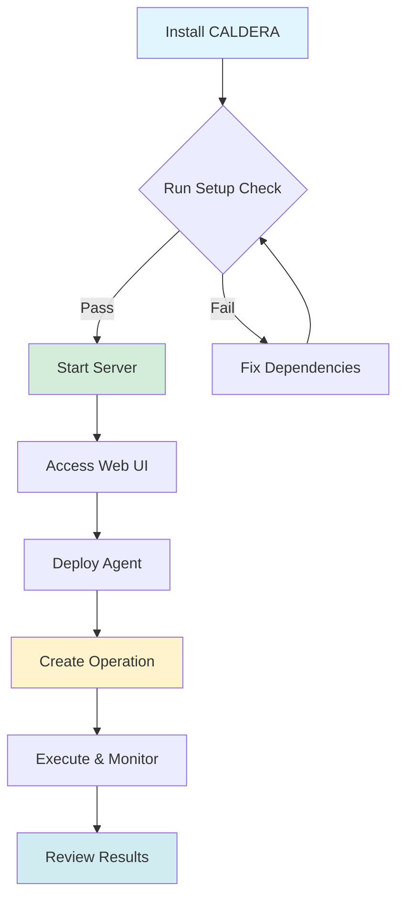

> ## 📦 ARCHIVE NOTICE
> 
> **This repository is archived and no longer actively maintained.**
> 
> This is a snapshot of MITRE Caldera v5.0.0 (Triskele Labs Enhanced) as of **February 10, 2026**.  
> It includes custom orchestration features (Phases 1-6) developed for multi-environment campaign  
> management, webhook integration, and PDF reporting capabilities.
> 
> **For the actively maintained MITRE Caldera project:**
> - Official Repository: https://github.com/mitre/caldera
> - Documentation: https://caldera.readthedocs.io
> 
> **This archived version includes:**
> - Global orchestration pattern for campaign management
> - Dynamic agent enrollment REST API
> - ELK Stack integration with webhook publishing
> - PDF reporting with ATT&CK Navigator visualisations
> - Azure deployment templates (Bicep IaC)
> 
> The code is provided as-is for reference purposes. No updates, bug fixes, or support  
> will be provided. Issues and pull requests are disabled.

---

[](https://github.com/mitre/caldera/releases)
[](http://caldera.readthedocs.io/?badge=stable)

# MITRE Caldera&trade;

MITRE Caldera&trade; is a cyber security platform designed to easily automate adversary emulation, assist manual red-teams, and automate incident response.

It is built on the [MITRE ATT&CK™ framework](https://attack.mitre.org/) and is an active research project at MITRE.

The framework consists of two components:

1) **The core system**. This is the framework code, consisting of what is available in this repository. Included is
an asynchronous command-and-control (C2) server with a REST API and a web interface.
2) **Plugins**. These repositories expand the core framework capabilities and providing additional functionality. Examples include agents, reporting, collections of TTPs and more.

## Quick Start Flowchart



## Resources & Socials
* 📜 [Documentation, training, and use-cases](https://caldera.readthedocs.io/en/latest/)
* 🎬 [Tutorial Videos](https://www.youtube.com/playlist?list=PLF2bj1pw7-ZvLTjIwSaTXNLN2D2yx-wXH)
* ✍️ [Caldera's blog](https://medium.com/@mitrecaldera/welcome-to-the-official-mitre-caldera-blog-page-f34c2cdfef09)
* 🌐 [Homepage](https://caldera.mitre.org)

## Plugins

:star: Create your own plugin! Plugin generator: **[Skeleton](https://github.com/mitre/skeleton)** :star:

### Default
These plugins are supported and maintained by the Caldera team.
- **[Access](https://github.com/mitre/access)** (red team initial access tools and techniques)
- **[Atomic](https://github.com/mitre/atomic)** (Atomic Red Team project TTPs)
- **[Builder](https://github.com/mitre/builder)** (dynamically compile payloads)
- **[Caldera for OT](https://github.com/mitre/caldera-ot)** (ICS/OT capabilities for Caldera)
- **[Compass](https://github.com/mitre/compass)** (ATT&CK visualizations)
- **[Debrief](https://github.com/mitre/debrief)** (operations insights)
- **[Emu](https://github.com/mitre/emu)** (CTID emulation plans)
- **[Fieldmanual](https://github.com/mitre/fieldmanual)** (documentation)
- **[GameBoard](https://github.com/mitre/gameboard)** (visualize joint red and blue operations)
- **[Human](https://github.com/mitre/human)** (create simulated noise on an endpoint)
- **[Magma](https://github.com/mitre/magma)** (VueJS UI for Caldera v5)
- **[Manx](https://github.com/mitre/manx)** (shell functionality and reverse shell payloads)
- **[Response](https://github.com/mitre/response)** (incident response)
- **[Sandcat](https://github.com/mitre/sandcat)** (default agent)

- **[SSL](https://github.com/mitre/SSL)** (enable https for caldera)
- **[Stockpile](https://github.com/mitre/stockpile)** (technique and profile storehouse)
- **[Training](https://github.com/mitre/training)** (certification and training course)

### Custom Enhancements (Triskele Labs)
- **Enrollment** (Dynamic agent enrollment REST API for CI/CD integration)
- **Orchestrator** (Webhook publisher and SIEM integration)
- **Sequencer** (Campaign sequencing and operation chaining)
- **Branding** (Custom UI theming for Triskele Labs)

See [ORCHESTRATION_GUIDE.md](ORCHESTRATION_GUIDE.md) for implementation details.

### More
These plugins are ready to use but are not included by default and are not maintained by the Caldera team.
- **[Arsenal](https://github.com/mitre-atlas/arsenal)** (MITRE ATLAS techniques and profiles)
- **[BountyHunter](https://github.com/fkie-cad/bountyhunter)** (The Bounty Hunter)
- **[CalTack](https://github.com/mitre/caltack.git)** (embedded ATT&CK website)
- **[SAML](https://github.com/mitre/saml)** (SAML authentication)

## Requirements

These requirements are for the computer running the core framework:

* Any Linux or MacOS
  * Python 3.10+ (with Pip3)
* Recommended hardware to run on is 8GB+ RAM and 2+ CPUs
* Recommended: [GoLang 1.24+](https://go.dev/doc/install) to dynamically compile GoLang-based agents.
* NodeJS (v16+ recommended for v5 VueJS UI)

## Installation

Note: we HIGHLY recommend installing Caldera in a Python virtual environment to avoid issues with pip packages. You can use an existing environment if you wish or create a new one from scratch:
```Bash
python3 -m venv .calderavenv
source .calderavenv/bin/activate
```

Concise installation steps:
```Bash
git clone https://github.com/mitre/caldera.git --recursive
cd caldera
pip3 install -r requirements.txt
python3 server.py --insecure --build
```

Full steps:
Start by cloning this repository recursively, passing the desired version/release in x.x.x format. This will pull in all available plugins.
```Bash
git clone https://github.com/mitre/caldera.git --recursive --tag x.x.x
```

Next, install the PIP requirements:
```Bash
pip3 install -r requirements.txt
```

Finally, start the server.
```Bash
python3 server.py --insecure --build
```

The `--build` flag automatically installs any VueJS UI dependencies, bundles the UI into a dist directory and is served by the Caldera server. You will only have to use the `--build` flag again if you add any plugins or make any changes to the UI. Once started, log into http://localhost:8888 using the default credentials red/admin. Then go into Plugins -> Training and complete the capture-the-flag style training course to learn how to use Caldera.

If you prefer to not use the new VueJS UI, revert to Caldera v4.2.0. Correspondingly, do not use the `--build` flag for earlier versions as not required.

**Additionally, please note [security recommendations](#Security) for deploying Caldera.**

## Docker Installation

Local build:
```sh
git clone https://github.com/mitre/caldera.git --recursive
cd caldera
docker build --build-arg VARIANT=full -t caldera .
docker run -it -p 8888:8888 caldera
```

Adjust the port forwarding (`-p`) and build args (`--build-arg`) as desired. The ports exposed depend on which contacts you plan on using (see `Dockerfile` and `docker-compose.yml` for reference).

## Security

The Caldera team highly recommends standing up the Caldera server on a secure environment/network, and not exposing it to the internet. The Caldera server does not have a hardened and thoroughly pentested web application interface, but only basic authentication and security features. Both MITRE and MITRE's US Government sponsors nearly exclusively only use Caldera on secure environments and do not rely on Caldera's own security protocols for proper cyber security.

### Vulnerability Disclosures

Refer to our [Vulnerability Disclosure Documentation](SECURITY.md) for submitting bugs.

#### Recent Vulnerability Disclosures

`🚨Security Notice🚨`: (17 Feb 2025 10:00 EST) Please pull v5.1.0+ for a recent security patch for [CVE-2025-27364](https://www.cve.org/CVERecord?id=CVE-2025-27364). Please update your Caldera instance, especially if you host Caldera on a publicly accessible network. [Vulnerability walkthrough.](https://medium.com/@mitrecaldera/mitre-caldera-security-advisory-remote-code-execution-cve-2025-27364-5f679e2e2a0e)

## Licensing

To discuss licensing opportunities, please reach out to caldera@mitre.org or directly to [MITRE's Technology Transfer Office](https://www.mitre.org/about/corporate-overview/contact-us#technologycontact).
